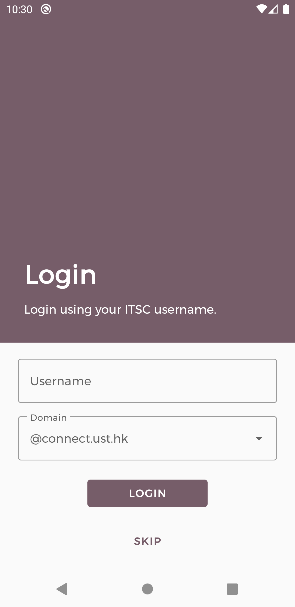

# Foobar++ Android

Foobar++ is a group ordering and delivery application.

## Description

Food ordering and delivery services such as FoodPanda serve individual customers. Many restaurants do not deliver to the UST area. This project will create a mobile app that supports group orders to individual vendors.

## Architecture

* **App** -  A layer that interacts with the UI. Contains of UI-related elements such as Activities, Fragments, ViewModels. It depends on both data and domain module.

* **Domain** - A layer that contains business logic. It will include all the usecases and abstractions of the application. It is a separated pure Java module.

* **Data** - A layer that implement the interface exposed by the domain layer and dispenses data to the app layer.


## Libraries Used

* **Fragment** - Segment your app into multiple, independent screens that are hosted within an Activity.

* **Hilt** - Extend the functionality of Dagger Hilt to enable dependency injection of certain classes from the androidx libraries.

* **Lifecycle** - Build lifecycle-aware components that can adjust behavior based on the current lifecycle state of an activity or fragment.

* **Material Components** - Provides material-themed UI components.

* **Navigation** - Build and structure your in-app UI, handle deep links, and navigate between screens.

* **Paging** - Load data in pages, and present it in a RecyclerView.

* **Room** - Create, store, and manage persistent data backed by a SQLite database.

* **Glide** - Media management and image loading framework.

* **Kotlin Coroutines** - Managing asynchronous tasks with simplified codes and reducing needs for callbacks.

## Device Requirements

* Android 6.0+ (API level 23).
* Google Play Service installed.


## Usage
1. Download the project.

```console
git clone https://github.com/foobar-UST/foobar-android.git
```

2. Compile the project with Android Studio.

3. Run the app on your devices or emulators.

## Dependency Updates
```console
./gradlew checkDependencyUpdates
```

## Generate License Report
```console
./gradlew licenseReleaseReport
```

## Screenshots



